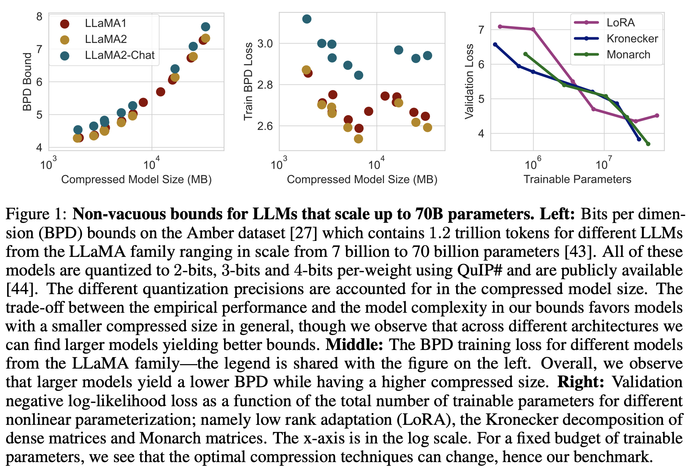

# Unlocking Tokens as Data Points for Generalization Bounds on Larger Language Models

[]() []()

This repository contains the code for [Unlocking Tokens as Data Points for Generalization Bounds on Larger Language Models](https://arxiv.org/abs/2407.18158) by [Sanae Lotfi*](https://sanaelotfi.github.io), [Yilun Kuang*](https://yilunkuang.github.io/), [Brandon Amos](https://bamos.github.io/), [Micah Goldblum](https://goldblum.github.io), [Marc Finzi](https://mfinzi.github.io), and [Andrew Gordon Wilson](https://cims.nyu.edu/~andrewgw/). 


## Introduction

In this work, we propose token-level generalization bounds for LLMs and use our bounds to derive insights about the generalization properties and limitations of LLMs. Namely, we make the following contributions:

- **Novel token-level generalization bounds for the unbounded negative log-likelihood objective:** we derive a new generalization bound that considers each sample to be an individual token. Even though tokens within a document are not independent, we use properties of martingales to obtain a valid bound that benefits from the number of tokens in a language model's pretraining dataset.
- **Exploring LLM compressions by training in the structured matrices subspace:** we explore several expressive model compression techniques such as Monarch matrices, Kronecker factorizations, and post-training quantization and show that bounding the performance at the token-level favors less restrictive compression strategies. 
- **Generalization Bounds for Open-Source Pretrained LLMs up to 70B parameters:** Our work is the first to compute non-vacuous generalization bounds for models compressed only through post-training quantization and without altering the pretraining procedure at all. 
Consequently, we obtain generalization bounds for massive pretrained LLMs like LLaMA2-70B, which generate high-quality text. 
- **Generalization Bounds for LLMs after Supervised Finetuning:** Our experiments in indicate that the chat versions of LLaMA have looser generalization guarantees, demonstrating that fine-tuning these models for dialogue negatively affects their performance on the next token prediction task.
- **LLMs model long-range dependency:** We demonstrate that GPT2 models that are restricted to only seeing $k$ tokens in their context for training and evaluation obtain significantly better bounds than $k$-th order Markov chains for high values of $k$, reflecting the remarkable ability of transformer-based models in capturing longer range correlations.  
- **Memorization vs. Compression:** We show in the paper that a model's ability to recall memorized facts from its pretraining data deteriorates faster than its ability to recognize structured patterns as we decrease the size of the model through compression, distinguishing between compressible tasks where generalization is possible and incompressible tasks that correspond to sheer memorization. 




## Environment Installation

```bash
conda env create -f environment.yml
```

## Token-Level Generalization Bounds Evaluation for Pretrained Model Checkpoints

### Open-Source LLMs for Bounds Evaluations
We compute token-level bounds on pretrained LLaMA1 and LLaMA2 models quantized with QuIP# with publicly-available checkpoints in https://github.com/Cornell-RelaxML/quip-sharp. To download all the model checkpoints, we can run the following script:
```bash
bash scripts/download_quip_models/get_wget_command.sh <base_output_dir>
bash scripts/download_quip_models/parallelize_download.sh <commands_file>
```
In order to evaluate bounds, we need to precompute the compressed size $C(h)$ of QuIP#-quantized models. We do so by using `gzip` and read off the size of the model checkpoint files in bits. Here is an illustrative example of getting the model size

```bash
# single checkpoint file
gzip -c model.safetensors > model.safetensors.gz
ls -l model.safetensors.gz

# multiple checkpoint files
tar -czvf combined_checkpoint.tar.gz model-00001-of-00002.safetensors model-00002-of-00002.safetensors
ls -l combined_checkpoint.tar.gz
```
To compute the model compressed size in parallel, we provide the following scripts:
```bash
bash scripts/get_prefix_message_length/get_prefix_message_length_script.sh <base_dir>
bash scripts/get_prefix_message_length/print_prefix_message_length_script.sh <base_dir>
```


### Dataset: LLM360 

To compute token-level generalization bounds, we need to download the LLM360 dataset from https://github.com/LLM360/amber-data-prep. The downloaded datasets need to be processed in the same fashion as shown in the nanoGPT repo https://github.com/karpathy/nanoGPT/tree/master/data/openwebtext.

For example, the dataset needs to be processed to have the `train.bin` and `val.bin` split with the following loading functions:

```python 
import numpy as np
data = np.memmap("/scratch/yk2516/amber-data-prep/tokenized_data/redpajama_v1/arxiv/train.bin", dtype=np.uint16, mode='r')
```
For different models with different tokenizers, the preprocessing and the resulting file `train.bin` and `val.bin` files will be different. 

Once all the datasets from LLM360 are tokenized, we need to build a categorical distribution over the dataset for sampling during bounds evaluation using the following scripts:
```bash
cd token-bounds-llms/data/llm360/
python get_categorical_dist.py --output_dir <output_dir>
```


<!-- To perform pretraining, we first need to download and preprocess the OpenWebText dataset (See more details in https://github.com/karpathy/nanoGPT/blob/master/README.md). You can get the dataset by running -->


### Token-Level Bounds Evaluations

To evaluate token-level generalization bounds, we provide the following command:

```bash
python experiments/eval_bounds.py --config-file=config/config_original_model_bounds.yaml --bounds.misc_extra_bits=2 --sublora.intrinsic_dim=0 --optimizer.learning_rate=0.0002 --model.best_checkpoint_path=<path_to>/quip_model_checkpoints/<model_name> --model.init_from=relaxml/<model_name> --bounds.bound_type=token_level --bounds.bound_samples=10000 --bounds.use_quip=True --bounds.quip_model=relaxml/<model_name> --bounds.quip_model_cache_dir=<cache_dir> --data.dataset_dir=None --data.dataset=llm360 --data.vocab_size=32000 --data.eot_token=2 --data.batch_size=1 --bounds.eval_batch_size=1
```

It's also possible to sweep over token-level bounds evaluation for all of the QuIP# quantized LLaMA1 and LLaMA2 models using the following scripts:

```bash
bash parallel_submit_quip_llama_model_llm360.sh
```

The commands inside `--wrap` needs to be changed for the specific model paths and dataset paths. 

## Citation
Please cite our work if you find it helpful in your work:
```
@article{lotfi2024unlockingtokensdatapoints,
    title={Unlocking Tokens as Data Points for Generalization Bounds on Larger Language Models}, 
    author={Lotfi, Sanae and Kuang, Yilun and Amos, Brandon and Goldblum, Micah and Finzi, Marc and Wilson, Andrew Gordon},
    journal={arXiv preprint arXiv:2407.18158},
    year={2024}
}
```
